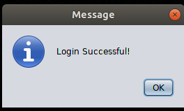
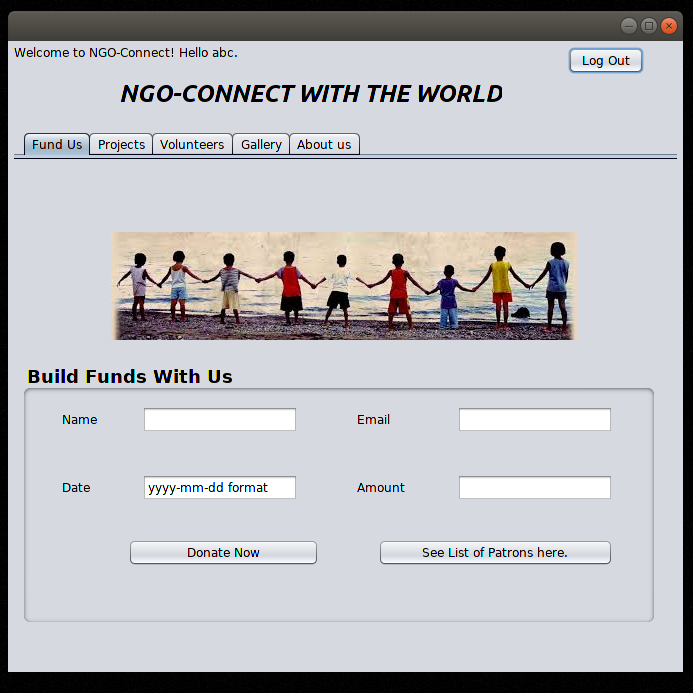
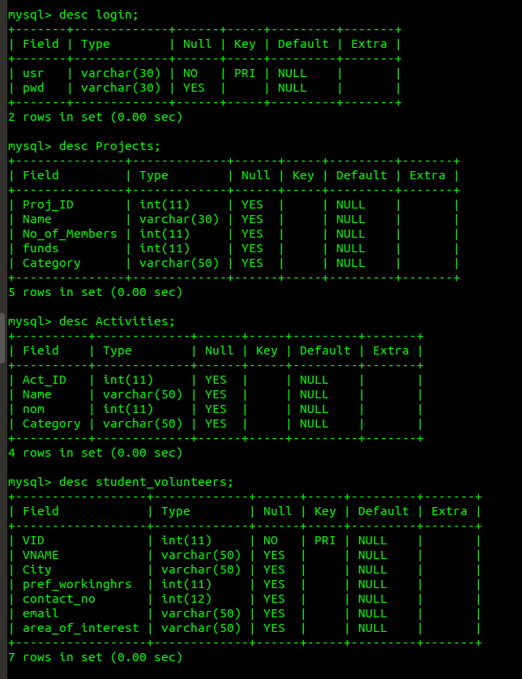
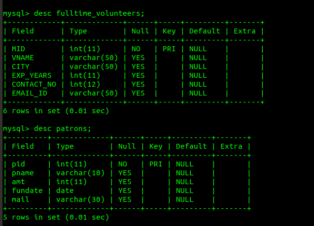

# netbeans_jdbc_mysql
## NGO connect :
Made using MySQL and Netbeans, has various forms, including Login, Mainpage, Join us and gets records from Mysql database using sql queries in java swing.
Connectivity is through JDBC and we need to import a mysql jar file in libraries for program to work.

### SAMPLE FORMS :

Login page is the first page that runs on start.
If Login is successful, a message will be displayed and if not, then acoording to that a message will be displayed.

The mainpage looks like this, which also displays the name of the user in the left hand corner with a welcome message.

## MySQL Database Structure :
Database has the following tables with their descriptions(with primary keys) -

Joins(left, right, inner and within databases and tables) and data retrival(with conditions) has been taken care of in this.
